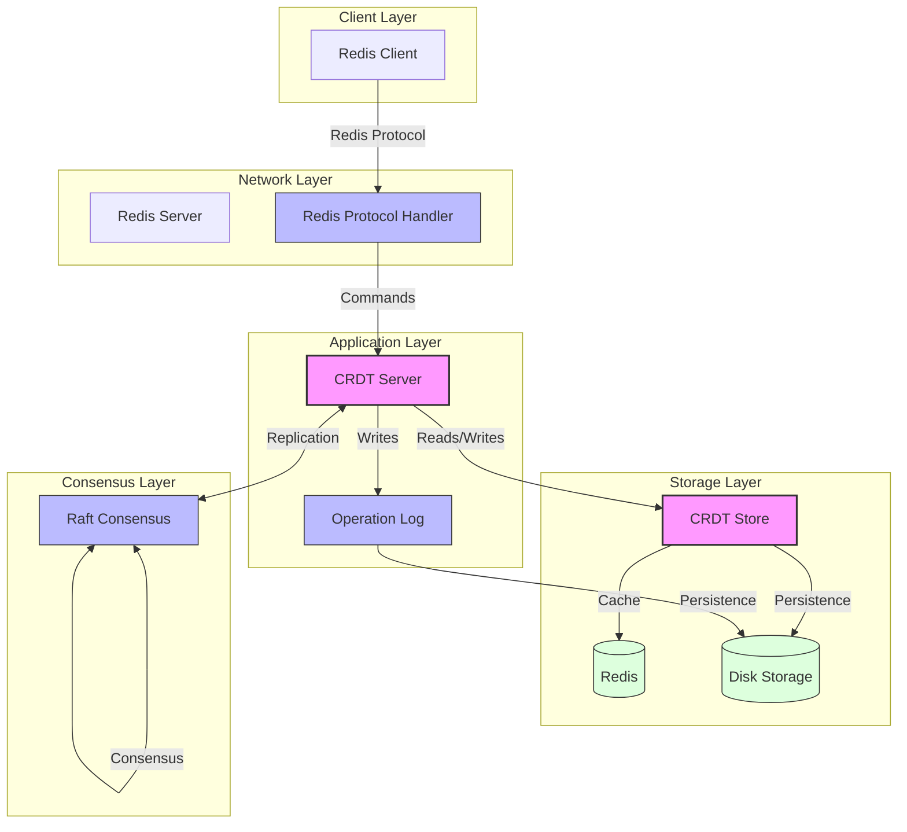

# CRDT Redis Architecture

This document describes the architecture of the CRDT Redis implementation.

## System Architecture Diagram

## Component Description

### Client Layer
- **Redis Client**: Standard Redis clients can connect to the system using the Redis protocol

### Network Layer
- **Redis Protocol Handler**: Handles Redis protocol communication and command parsing
- **Redis Server**: Manages client connections and routes commands to the CRDT server

### Application Layer
- **CRDT Server**: Core server component that handles command processing and CRDT operations
- **Operation Log**: Maintains a log of all operations for CRDT convergence and replication

### Storage Layer
- **CRDT Store**: Implements CRDT logic and manages data storage
- **Redis**: Used as a fast cache layer
- **Disk Storage**: Persistent storage for both CRDT state and operation logs

### Consensus Layer
- **Raft Consensus**: Ensures consistent replication across nodes in the cluster

## Key Features

1. **CRDT Implementation**
   - Conflict-free replicated data types
   - Automatic conflict resolution
   - Eventually consistent

2. **Hybrid Storage**
   - In-memory state
   - Redis cache layer
   - Persistent disk storage

3. **Distributed Consensus**
   - Raft-based replication
   - Operation log synchronization
   - Leader election

4. **Redis Compatibility**
   - Redis protocol support
   - Standard Redis client support
   - Familiar Redis commands

## Data Flow

1. Clients connect using standard Redis protocol
2. Commands are processed by the CRDT server
3. Operations are logged and replicated via Raft
4. Data is stored in memory, Redis cache, and disk
5. Changes are propagated to other nodes through operation log sync

## Consistency Model

The system provides eventual consistency through CRDT operations:
- All replicas eventually converge to the same state
- Conflicts are automatically resolved using CRDT rules
- Operations are timestamped and replicated across nodes
